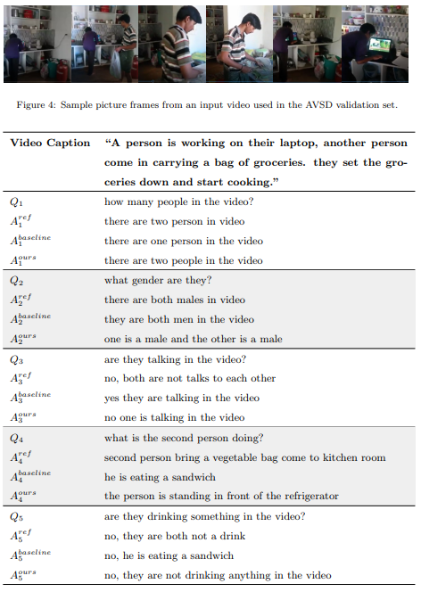

## Multimodal Transformer Networks for End-to-End Video-Grounded Dialogue Systems
 [](https://opensource.org/licenses/MIT) 

This is the PyTorch implementation of the paper:
**[End-to-End Multimodal Dialog Systems with Hierarchical Multimodal Attention on Video Features](<http://workshop.colips.org/dstc7/papers/09.pdf>)**. [**Hung Le**](https://github.com/henryhungle), [Steven C.H. Hoi](https://sites.google.com/view/stevenhoi/), [Doyen Sahoo](http://www.doyensahoo.com/), [Nancy F. Chen](https://sites.google.com/site/nancyfchen/home). ***DSTC Workshop at AAAI 2019***. 


This code has been written using PyTorch 1.0.1. If you use any source code included in this repo in your work, please cite the following paper. The bibtex is:
<pre>
@inproceedings{le2019end,
  title={End-to-End Multimodal Dialog Systems with Hierarchical Multimodal Attention on Video Features},
  author={Le, Hung and Hoi, S and Sahoo, Doyen and Chen, N},
  booktitle={DSTC7 at AAAI2019 workshop},
  year={2019}
}
</pre>

## Abstract
We present our work on the Dialog System Technology Challenges 7 (DSTC7). We participated in Track 3, which evaluated how dialog systems understand video scenes and response to users about the video visual and audio content. Our system is built upon the baseline system (Hori et al. 2018) with changes adopted similarly to (Anderson et al. 2018). The model utilizes different types of attentions on video caption
and the video audio and visual input that contribute to the improved evaluation results. We also applied a nonlinear feature fusioning of the visual and audio features to improve the results further. Our proposed model showed improved performance in terms of both objective evaluation and human rating, surpassing the performance of the baseline.


## Model Architecture

<p align="center">

Overview of the proposed end-to-end multimodal dialogue systems with attention mechanisms  on  multimodal  features  and  video  caption  embedding.   The  model  follows  the encoder-decoder framework, including 3 major components:  (1) RNN Encoders that encode the  dialogue  context,  the  video  caption,  and  the  user  query  into  fixed  dimensional  representations;  (2) Hierarchical Attentions that include self-attention on question features,  and question-guided attentions on video features as well as on caption features; and (3) RNN Decoder that uses the contextual joint features and generates system responses token-by-token.
</p>


## Dataset

Download [dataset](<https://drive.google.com/drive/folders/1SlZTySJAk_2tiMG5F8ivxCfOl_OWwd_Q>) of the DSTC7, Video-Scene Aware Dialogues Track, including the training, validation, and test dialogues and the features of Charades videos extracted using VGGish and I3D models. 

All the data should be saved into folder `data` in the repo root folder.

## Pretrained Word Embedding

Download all pretrained embedding weights and save into folder `data` in the repo root folder.

The following word pretrained embedding weights are considered: 

- [Word2Vec](https://code.google.com/archive/p/word2vec/) 
- [Glove](https://nlp.stanford.edu/projects/glove/) 
- [FastText](https://fasttext.cc/docs/en/english-vectors.html) 

## Scripts 

We created `run.sh` to prepare evaluation code, train models, generate_responses, and evaluating the generated responses with automatic metrics. You can run:

```console
❱❱❱ run.sh [execution_stage] [pretrained_word_embedding] [embedding_dimension] [numb_epochs] 
```
The parameters are: 

| Parameter                 | Description                                                  | Values                                                       |
| :------------------------ | :----------------------------------------------------------- | ------------------------------------------------------------ |
| execution_state           | Stage of execution e.g. preparing, training, generating, evaluating | <=1: preparing evaluation code by downloading the COCO caption evaluation tool <br /><=2: training the models<br /><=3: generating responses using beam search (default)<br /><=4: evaluating the generated responses |
| pretrained_word_embedding | Name of the file that stores the pretrained word embedding weights | e.g. <br />none: no embedding pretraining<br />Word2vec: GoogleNews-vectors-negative300.bin<br />Glove: glove.6B.50d.txt, glove.6B.100d.txt, glove.6B.200d.txt, glove.6B.300d.txt<br />FastText: wiki-news-300d-1M.vec, crawl-300d-2M.vec |
| embedding_dimension       | Dimension for embedding weights                              | e.g. 512 (default)<br />The value should matched pretrained embedding dimension if pretrained weights are used |
| num_epochs                | Number of training epochs                                    | e.g. 15                                                      |

While training, the model with the best validation is saved. The model is evaluated by using loss per token. The model output, parameters, vocabulary, and training and validation logs will be save into folder `exps`.  

Other parameters, including data-related options, model parameters,  training and generating settings, are defined in the `run.sh` file.

## Sample Dialogues
<p align="center">

 Example test dialogue responses extracted from the ground-truth and generated by our best model and the baseline. 
</p>

## References

- C. Hori, T. Hori, T.-Y. Lee, Z. Zhang, B. Harsham, J. R. Hershey, T. K. Marks, K. Sumi, Attention-based multimodal fusion for video description, in: Computer Vision (ICCV), 2017 IEEE International Conference on, IEEE, 2017, pp. 4203–4212.
- P. Anderson, X. He, C. Buehler, D. Teney, M. Johnson, S. Gould, L. Zhang,Bottom-up and top-down attention for image captioning and visual question answering, in: CVPR, Vol. 3, 2018, p. 6.

